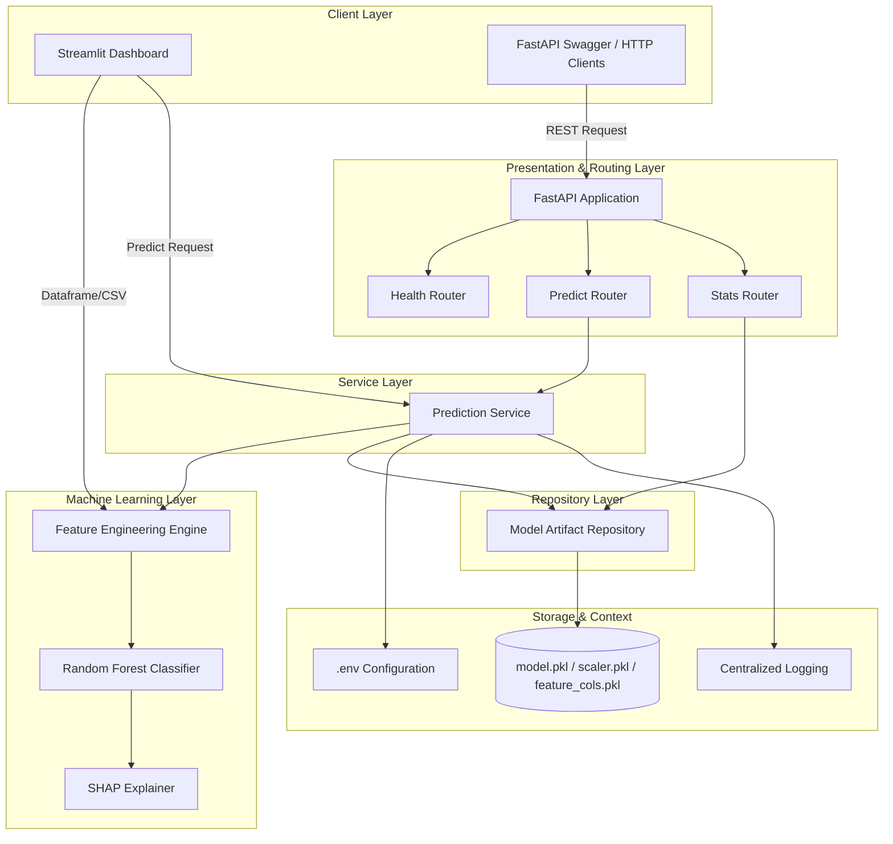

# ERP Anomaly Detector Architecture

This document describes the modular, production-ready architecture of the ERP Anomaly Detector application.

## System Architecture

## Folder Structure

- **`backend/`**: Contains the FastAPI backend application.
  - **`api/`**: Routing configuration (versioned API sub-routers).
  - **`auth/`**: Optional API key authentication guards.
  - **`core/`**: Configuration via environment files, customized exceptions, logging utilities.
  - **`middleware/`**: Request logging, exception-to-HTTP mapping handlers.
  - **`models/`**: Domain objects representation placeholder.
  - **`repositories/`**: Handles lazy-loading and thread-safe loading of models and scalers.
  - **`schemas/`**: Pydantic input and output structures.
  - **`services/`**: Prediction and batch evaluation business logic.
  - **`utils/`**: Shared risk calculators and helpers.
  - **`main.py`**: Uvicorn server runner and setup hook execution.

- **`frontend/`**: Streamlit graphical dashboard.
  - **`dashboard.py`**: Streamlit layout using caching and core backend resources.

- **`ml/`**: Machine Learning pipeline modules.
  - **`training/`**: Script training classifiers and dumping serialized binaries.
  - **`evaluation/`**: Classification report and PR-AUC metric computation helpers.
  - **`features/`**: Feature extraction logic shared across services and applications.
  - **`explainability/`**: SHAP tree-explainers compiling importance attributes.

- **`artifacts/`**: Storage folder for `.pkl` files.
- **`data/`**: Storage folder for raw datasets (e.g. `creditcard.csv`).
- **`tests/`**: Pytest testing suites divided into unit (services, API, features) and integration categories.
- **`scripts/`**: DevOps utility setup and execution runners.

## Model Evaluation & Telemetry

### Isolation Forest PR-AUC Calculation
The baseline `IsolationForest` model does not support `predict_proba` for continuous probability estimation. Evaluating binary outputs directly for Precision-Recall Area Under the Curve (PR-AUC) loses key rank-ordering performance context.
* **Approach**: We compute PR-AUC using sample anomaly scores retrieved via `-model.decision_function(X_test)`.
* **Rationale**: In scikit-learn's `IsolationForest`, the raw decision function returns negative values for anomalies and positive values for normal data points. Negating these scores maps them into a standard coordinate system where higher values indicate a higher anomaly likelihood, matching the expectation of sklearn's `precision_recall_curve` against binary labels (where `1` indicates anomalies/fraud).

### Dynamic Telemetry
Upon pipeline evaluation via `scripts/run_pipeline.py`, classification metrics (Precision, Recall, PR-AUC, and sample sizes) for the active Random Forest classifier are written to `artifacts/model_metadata.json`. The Streamlit graphical frontend reads this file dynamically to update the sidebar, removing hardcoded statistics and ensuring synchronization with the latest training runs.
